<div align="center">


<br/>


</div>

<br/>


<table>
<tr>
<td width="56%" valign="top">

```python
class TheFierroS:
    role          = "full stack enjoyer"
    learning      = ["AI", "Machine learning", "Deep learning"]
    main_language = "Python"
    currently     = "elenchus, a refutation-driven RE agent"
    stack = {
        "frontend": ["React", "Next.js", "TypeScript"],
        "backend":  ["FastAPI", "Node.js", "Express"],
        "data":     ["MongoDB", "RAG pipelines"],
        "ml":       ["PyTorch", "scikit-learn"],
        "re":       ["Ghidra", "x86-64", "Windows PE"],
    }
    also  = ["Security tooling", "Gaming"]
    motto = "Code. Patient. Passion."

    def work(self, claim):
        return claim if survives(refute(claim)) else None
```

</td>
<td width="44%" valign="top">

| Player card | |
|:--|:--|
| **Class** | Full stack enjoyer |
| **Main weapon** | Python |
| **Off-hand** | TypeScript |
| **Skill tree** | AI / ML, reverse engineering |
| **Buffs** | Coffee, Ghidra, lo-fi |
| **Bugs slain** | Uncountable |
| **Current quest** | elenchus |
| **Level** | `∞` |

</td>
</tr>
</table>



<div align="center">

**Frontend**
<br/>


**Backend & data**
<br/>


**AI / ML (learning)**
<br/>


**Reverse engineering & systems**
<br/>


<br/>


</div>



<div align="center">
<a href="https://github.com/TheFierroS/elenchus">
  
</a>
</div>

**elenchus** is a reverse engineering agent for Windows PE / x86-64 binaries. It proposes claims about a binary, tries to refute them, and keeps only what survives. Language models may *propose*; only deterministic verifiers may *confirm*.

```text
binary ──▶ Ghidra extraction ──▶ append-only event log
                                        │
      claim (proposed) ◀── model ◀──────┘
            │
            ▼
   deterministic verifier ──▶ refuted  /  survives
```



<div align="center">

<a href="https://github.com/TheFierroS/askesis"></a>
<a href="https://github.com/TheFierroS/port_scanner"></a>
<a href="https://github.com/TheFierroS/all_in_one_tool"></a>
<a href="https://github.com/TheFierroS/Inklens_Note_App"></a>

</div>



<div align="center">


</div>



<div align="center">
<picture>
  <source media="(prefers-color-scheme: dark)" srcset="https://raw.githubusercontent.com/TheFierroS/TheFierroS/output/github-snake-dark.svg" />
  <source media="(prefers-color-scheme: light)" srcset="https://raw.githubusercontent.com/TheFierroS/TheFierroS/output/github-snake.svg" />
  
</picture>
</div>

<br/>

<div align="center">

<br/><br/>

</div>

<br/>

